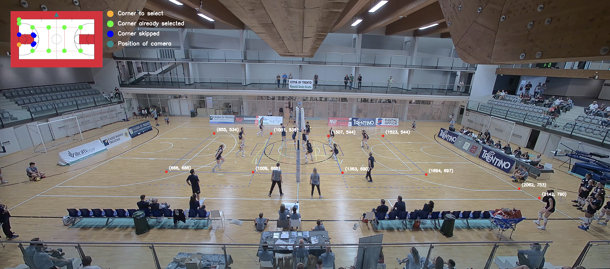
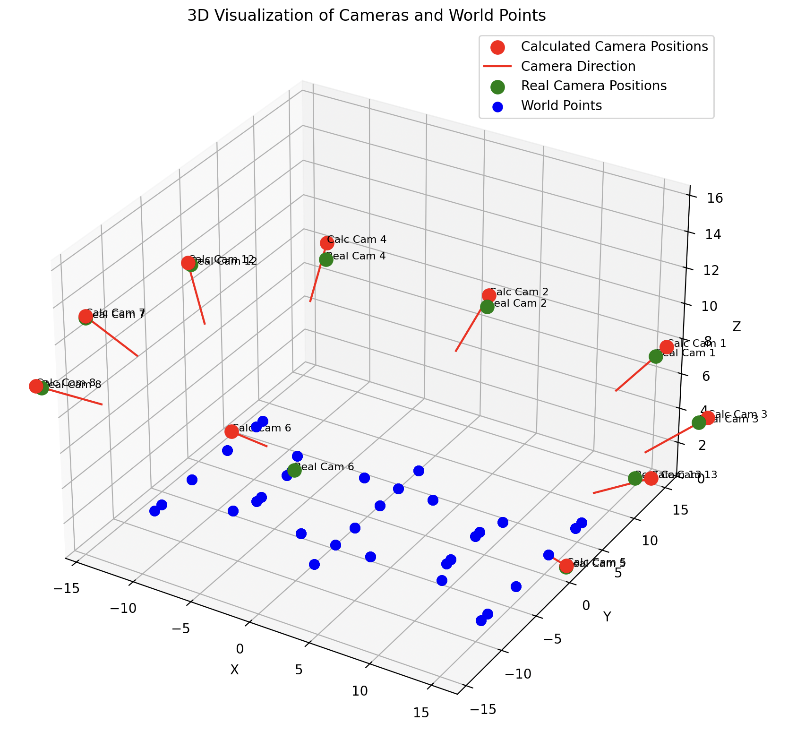
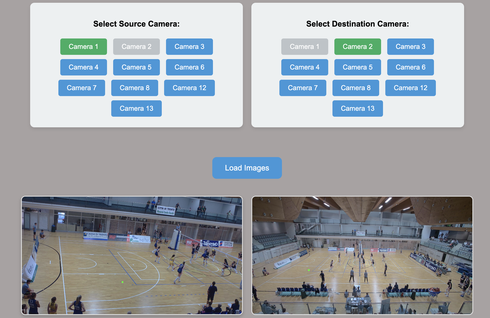
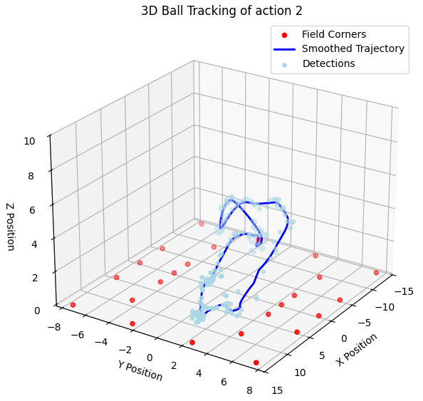

<div align="center">
  <h1 style="border-bottom: none;">Computer Vision project: 3D CAMERA CALIBRATION (geometry and 3D reconstruction)</h1>
  
  
  
  
</div>

This repository contains the code and resources for a Computer Vision project centered around 3D Camera Calibration, with applications in homography transformation and 3D ball tracking using YOLO.

## Table of Contents

- [Table of Contents](#table-of-contents)
- [Description](#description)
- [Project Structure](#project-structure)
- [1. Calibration](#1-calibration)
  - [Intrinsic parameter](#intrinsic-parameter)
  - [Extrinsic Parameters](#extrinsic-parameters)
- [2. Homography:](#2-homography)
- [3. 3D ball tracking](#3-3d-ball-tracking)

## Description

This project focuses on processing and analyzing a volleyball match captured from 10 different camera views. The project has been developed through these 3 main subtasks:
 
 1. **Calibration**: create a 3D reconstruction of the camera positions relative to the field, this task is divided into two steps:
    - intrinsic camera calibration
    - extrinsic camera calibration
 2. **Homography**: develop a tool that allows users to click on a specific point on the court or in any camera view, instantly displaying the corresponding point across another camera angle.
 3. **3D ball tracking**: reconstruct a 3D model of the court and plot the ball's trajectory using advanced tracking algorithms.

## Project Structure

```
src
├── 1_cameraCalibration
│   ├── cameraInfo.py
│   ├── extrinsics.py
│   ├── intrinsics.py
│   ├── selectPoints.py
│   └── utilsCameraCalibration
│       └── utilsSelectPoints.py
├── 2_MultiViewPoint
│   ├── cameraInfo.py
│   └── homography.py
├── 3_3dBallTracking
│   ├── extras
│   │   ├── cameraInfo.py
│   │   ├── createDataset.py
│   │   ├── particleFilter2D.py
│   │   ├── tracking2D.py
│   │   ├── tryYolo.py
│   │   └── yoloWindows.py
│   ├── plot3Dtrajectory.py
│   ├── saveDetections.py
│   ├── saveTriangulations.py
│   ├── tracking3D.py
│   └── utils3DBallTracking
│       ├── cameraInfo.py
│       ├── particleFilter3D.py
│       └── yoloWindows.py
├── app
│   ├── app.py
│   ├── cameraInfo.py
│   ├── static
│   │   ├── css
│   │   │   ├── style.css
│   └── templates
│       └── point_projection.html
└── utils
    ├── cameraInfo.py
    ├── config.py
    ├── utils.py
    └── viewAction.py
```

## 1. Calibration

At first we have calculate the **intrinsic** and **extrinsic** parameters.

### Intrinsic parameter

Some pinhole cameras introduce significant distortion to images, primarily in the form of radial and tangential distortion. These distortions can be corrected using a calibration process. For this, we use videos containing a chessboard pattern, and following the [OpenCV tutorial](https://docs.opencv.org/4.x/dc/dbb/tutorial_py_calibration.html), we compute the intrinsic camera matrix and mitigate distortion.

To run the calibration, use the following command:

```bash
python3 intrinsic.py
```

This is an example of the result:

<p align="center">
  
  &nbsp;&nbsp;&nbsp;&nbsp;&nbsp;&nbsp;&nbsp;&nbsp;&nbsp;&nbsp;&nbsp;&nbsp;
  
</p>

<p align="center">
  <i>Figure 1: Distorted Image Before Calibration</i> &nbsp;&nbsp;&nbsp;&nbsp;&nbsp;&nbsp;&nbsp;&nbsp;&nbsp;&nbsp;&nbsp;&nbsp; <i>Figure 2: Undistorted Image After Calibration</i>
</p>


### Extrinsic Parameters

To achieve the 3D reconstruction of camera positions relative to the field, we need to find the **extrinsic parameters**. These parameters describe the rigid body motion (rotation and translation) between the camera and the world frame. In order to compute the extrinsic matrix, at least **four paired points** from the camera plane to the real world are required. For this, we use a script that allows us to select notable points, typically the corners of the basketball or volleyball court.

To run this script, execute the following command:

```bash
python3 selectPoints.py
```
<p align="center">  <br> <i>Figure 3: Interface to select points.</i> </p>

Once the points are selected, they are saved in a *.json* file. You can then use this data to calculate the extrinsic parameters by running:

```bash
python3 extrinsic.py
```

This is the result:

<p align="center"> 
   <br> <i>Figure 4: Extrinsic parameters.</i> 
</p> 


## 2. Homography

To map points from an image plane to another we are in need of computing one homography matrix for each pair of cameras. To calculate these run the command:

```bash
python3 homography.py
```

Next, you can test the results using the web app for an improved user experience. To launch it:

```bash
python3 app.py
```

This is an example of the user interface:

<p align="center"> 
   <br> <i>Figure 5: user interface.</i> 
</p> 

## 3. 3D ball tracking

To track the trajectory of a vollay ball during a match, different steps are required: 

- Firstly you have to save detections of the ball from the different camera views using YOLO. In order to do that launch:

  ```bash
  python3 saveDetections.py
  ```

- Second step involve reconstructing the 3D world position of the ball given the 2D camera coordinates by using built-in OpenCV function. To do that simply launch:

  ```bash
  python3 saveTriangulations.py
  ```

- In the final step we estimate the trajectory of the ball by using particle filter. You can launch it with:

  ```bash
  python3 tracking3D.py
  ```

<p align="center"> 
   <br> <i>Figure 6: 3D plot of ball trajectory.</i> 
</p> 


# Contacts
For any inquiries, feel free to contact:

- Simone Roman - [simone.roman@studenti.unitn.it](mailto:simone.roman@studenti.unitn.it)

- Stefano Bonetto - [stefano.bonetto@studenti.unitn.it](mailto:stefano.bonetto@studenti.unitn.it)

<br>

<div>
    <a href="https://www.unitn.it/">
        
    </a>
</div>
